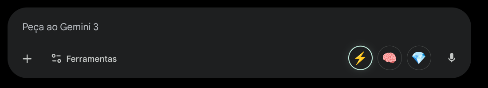
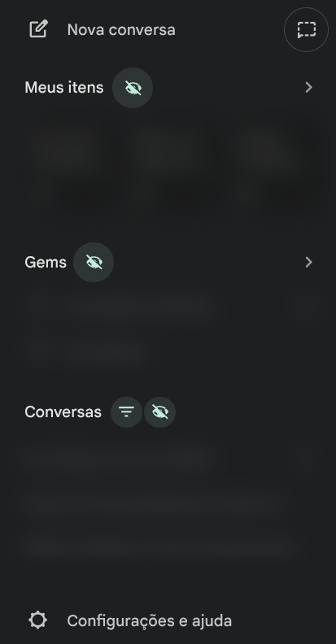
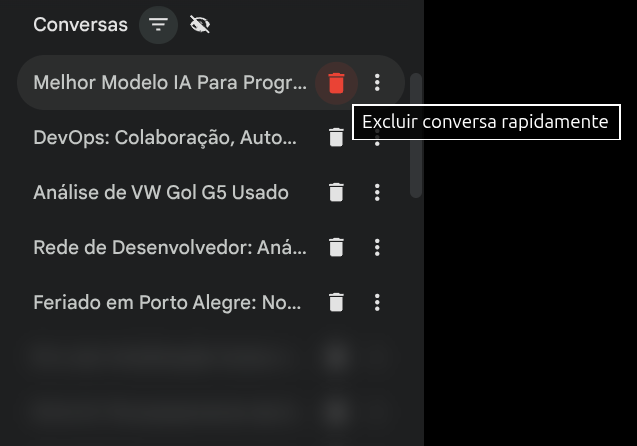

[🇧🇷 Português](README.md) | [🇬🇧 English](README_en.md) | [🇪🇸 Español](README_es.md) | [🇨🇳 中文](README_zh.md)

# 🔧 Gemini Tweak Extension

Extensión de Chrome para personalizar la interfaz de **Google Gemini** con controles de privacidad y atajos de productividad.

---

## ✨ Funcionalidades

### 🎛️ Selector de Modelos Rápido



- Botones de acceso rápido para cambiar entre los modelos de Gemini:
  - ⚡ **Rápido** - Respuestas más veloces
  - 🧠 **Razonamiento** - Mejor para tareas complejas
  - 💎 **Pro** - Modelo más avanzado

> Los modelos son accesibles directamente por botones (sin menú desplegable) y el estado del último modelo utilizado se guarda y restaura automáticamente al regresar a la página.

### 🔒 Controles de Privacidad (Blur/Censura)



Oculta secciones de la barra lateral con efecto de desenfoque (blur) para mayor privacidad:

| Sección | Descripción |
|---------|-------------|
| **Mis Elementos** | Oculta la sección de elementos recientes |
| **Gems** | Oculta la lista de Gems personalizados |
| **Historial de Conversaciones** | Oculta o limita las conversaciones visibles |

#### Modos del Historial:
- 👁️ **Visible** - Muestra todas las conversaciones
- 🔢 **Limitado** - Muestra solo las 5 primeras conversaciones (blur en las demás)
- 🚫 **Oculto** - Aplica blur en todo el historial

> **Nota:** Usamos blur en lugar de `display: none` para mantener el lazy loading de Gemini funcionando correctamente.

### 🗑️ Eliminación Rápida de Conversaciones



- Agrega un **botón de papelera** al lado de cada conversación.
- Permite eliminar conversaciones rápidamente sin confirmación manual (el flujo está automatizado).
- **Menú siempre visible**: Tanto la papelera como el menú de 3 puntos quedan fijos, facilitando el acceso.
- Colores de iconos adaptados para tema Claro y Oscuro.

---

## 🚀 Instalación

1. Clone o descargue este repositorio
2. Abra Chrome y vaya a `chrome://extensions/`
3. Active el **Modo de desarrollador** (esquina superior derecha)
4. Haga clic en **Cargar descomprimida**
5. Seleccione la carpeta del proyecto

---

## 📁 Estructura del Proyecto

```
geminiExtension/
├── manifest.json      # Configuraciones de la extensión
├── popup.html         # Interfaz del popup de configuraciones
├── popup.js           # Lógica del popup
├── styles.css         # Estilos CSS globales
├── src/               # Código fuente modularizado
│   ├── config/        # Configuraciones y constantes
│   ├── features/      # Funcionalidades (Botones, Barra lateral, etc)
│   ├── pageObjects/   # Selectores y abstracción del DOM
│   ├── states/        # Gestión de estado
│   └── utils/         # Funciones utilitarias
├── README.md          # Este archivo
├── screenshots/       # Imágenes de vista previa
└── docs/              # Documentación técnica
```

---

## ⚙️ Configuraciones


En la parte superior del popup, encuentras botones de **Acción Rápida**:
- **Estándar**: Restaura las configuraciones originales de la extensión.
- **Apagar Todo**: Desactiva todas las funcionalidades.
- **Encender Todo**: Activa todas las funcionalidades.

Abajo, las opciones detalladas:

| Categoría | Opción | Descripción |
|-----------|-------|-----------|
| **General** | Botones Alternativos | Activa los botones de cambio rápido de modelo en la parte superior |
| | Iniciar Barra Lateral Cerrada | Cierra la barra lateral automáticamente al cargar la página |
| **Clean UI** | Ocultar Saludo | Elimina el mensaje "Hola, usuario" |
| | Ocultar Bienvenida | Elimina el texto de bienvenida inicial |
| | Ocultar Sugerencias | Elimina las tarjetas de sugerencia de prompts |
| **Visibilidad**| Ocultar Historial | Aplica blur/oculta la lista de conversaciones recientes |
| | Limitar Historial (5) | Muestra solo los 5 ítems más recientes |
| | Ocultar Mis Elementos | Oculta la sección "Mis Elementos" |
| | Ocultar Gems | Oculta la sección "Gems" |
| **Productividad**| Eliminación Rápida | Agrega icono de papelera para borrar sin confirmación |
| | Menú Siempre Visible | Mantiene el menú (3 puntos) siempre visible, sin necesitar hover |

---

## 🎨 Tecnologías

- **Manifest V3** - Formato más reciente para extensiones Chrome
- **Vanilla JavaScript** - Sin dependencias externas
- **CSS puro** - Efectos de blur y transiciones

---

## 📝 Historial de Cambios (Changelog)

### v1.4 (2026-02-01)
- ✨ Agregada **Eliminación Rápida** de conversaciones (papelera)
- 🎨 Menú de conversaciones (3 puntos) ahora queda **siempre visible**
- 🎨 Iconos con colores adaptativos automáticos para temas Claro y Oscuro
- 🐛 Ajustes de diseño para evitar superposición de texto

### v1.3 (2026-02-01)
- ✨ Renombrado a "Gemini Tweak Extension"
- 🔧 Implementado sistema de blur en lugar de display:none
- 🐛 Corregido problema de lazy loading infinito
- 📚 Agregada documentación de la estructura DOM

### v1.2
- ➕ Agregados controles de privacidad (Mis Elementos, Gems, Historial)
- ➕ Modo de límite de 5 conversaciones

### v1.0
- 🎉 Versión inicial con selector de modelos

---

## 🤝 Contribución

¡Las contribuciones son bienvenidas! Antes de modificar, consulte la documentación de la estructura DOM en `docs/GEMINI_DOM_STRUCTURE.md`.

---

## 📄 Licencia

Este proyecto es de uso personal. Úselo bajo su propio riesgo.

---

## ⚠️ Aviso

Esta extensión no está afiliada a Google. Gemini puede actualizar su interfaz en cualquier momento, lo que puede romper funcionalidades de esta extensión.
